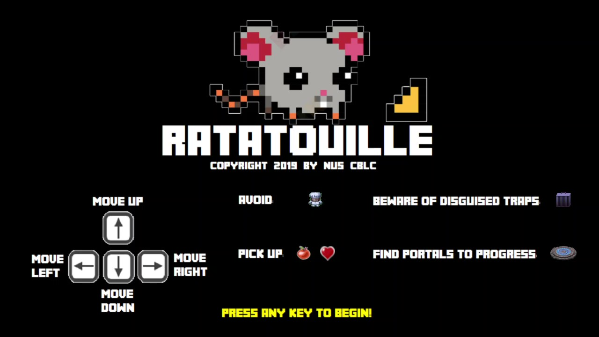
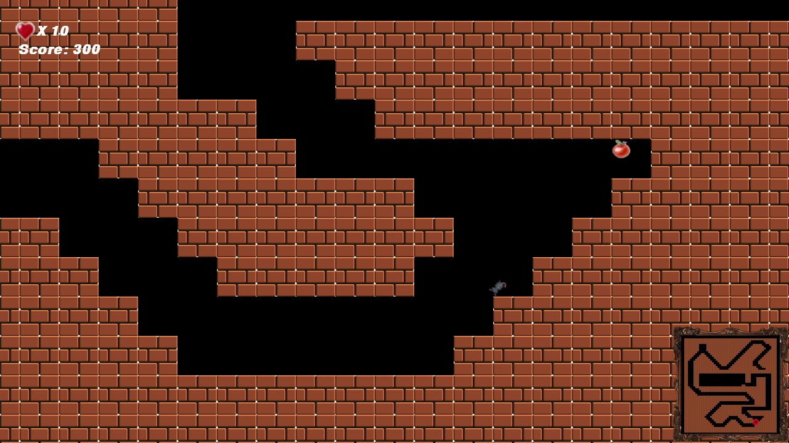
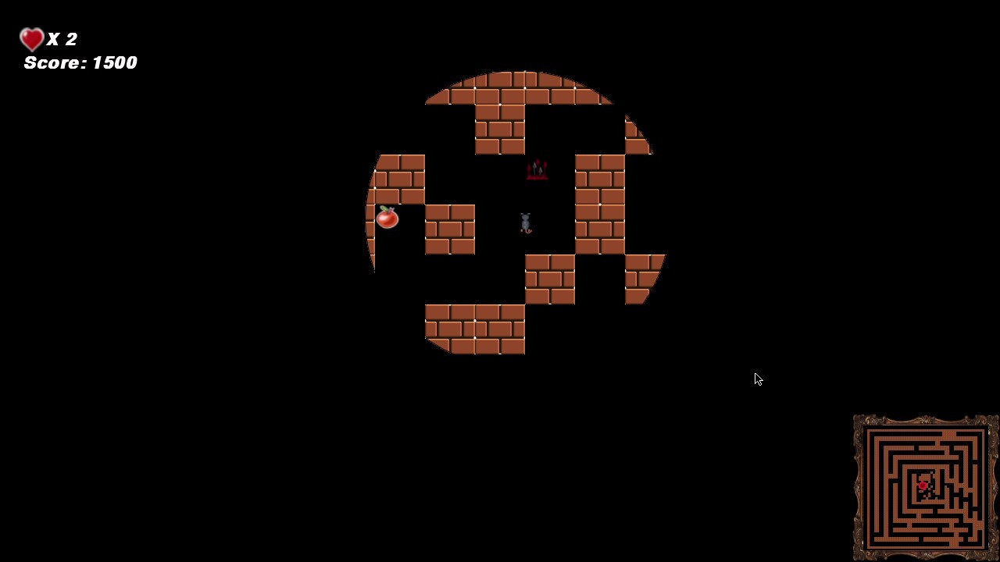
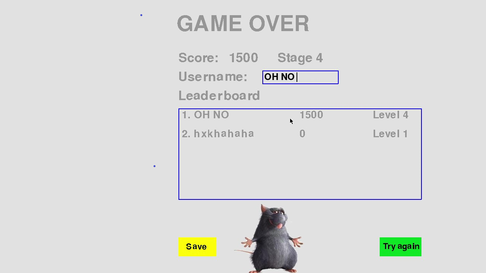
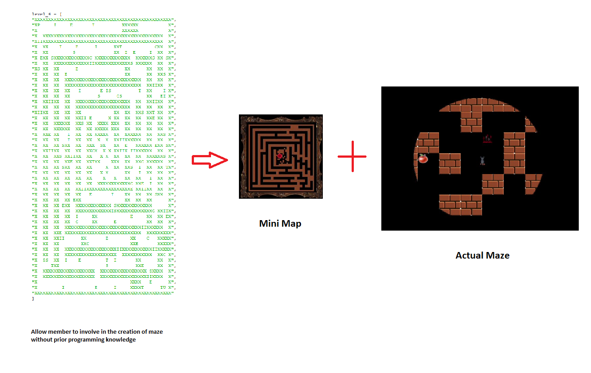

# A little Maze Game created for NUS CBLC Club Boothday
# Written in Python with pygame

Run MazeV5.py

Objective: Help Remy the rat navigate through the maze and find his “friends” while avoiding Chef Skinner from finding Remy. 

The player loses if Remy steps on a trap or if one of Chef Skinner’s men catches Remy. 
The player wins if Remy is able to successfully gather all of his friends while avoiding Chef Skinner and the traps.

Edit the array to create your own maze

